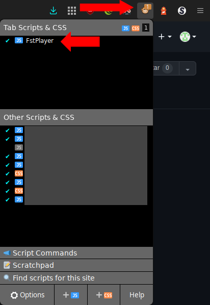
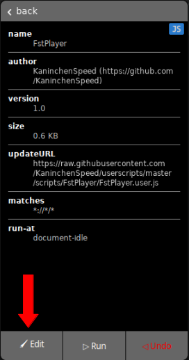
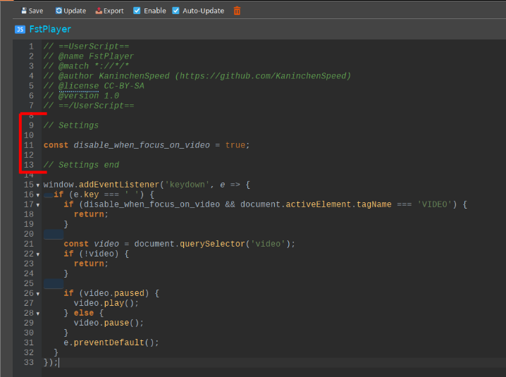

# My Userscripts

## installation
1. Install a Userscript addon
> Browser        | Addon
> -------------- | -------------------------------------------------------------------------
> Firefox        | [FireMonkey](https://addons.mozilla.org/en-US/firefox/addon/firemonkey/)
> other browsers | [Tampermonkey](https://www.tampermonkey.net/)

2. Click on the install link of the script 
> ### Downloads
>
> name                          | description                                               | install
> ----------------------------- | --------------------------------------------------------- | -------------------------------------------------------------------------------------------------------------------
> [censor.js](#Censore.user.js) | A userscript to censore custom defined words              | [install](https://raw.githubusercontent.com/KaninchenSpeed/userscripts/master/scripts/Censor.user.js)
> [FstPlayer](#FstPlayer)       | A userscript to always controll the first video on a page | [install](https://raw.githubusercontent.com/KaninchenSpeed/userscripts/master/scripts/FstPlayer/FstPlayer.user.js)

3. Configure
> 1. Open the menue of your userscript manager
> 2. Click on the userscript you want to configure
>> 
> 3. Click "Edit"
>> 
> 4. Change settings to desired value (possible values in table below)
>> 

 

## Censore.user.js
**This script might break some websites**

### coming soon

 

## FstPlayer
### configuration
setting                     | type (possible values)     | default | description
--------------------------- | -------------------------- | ------- | ----------------------------------------------------------------------------------
disable_when_focus_on_video | boolean (`true` / `false`) | `true`  | disables this userscript when a video element is focused (last clicked element)